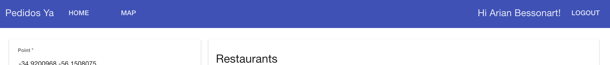

## Pedidos Ya Web App evaluation

## Run

```
npm install
gulp
```

## Components

### Framework
The Web App is implemented with AngularJs Framework as a Single Page Application.

### UI Component framework
Use material with **angular-material** library.

### Input errors
All input has a control for his correct behavior.

1. Required
2. Pattern
  - Email
  - Coordinate

### Authorization
Only an authenticated user could move from login view, this one is covered with events on rootScope.

1. On location change using url path:
```javascript
$rootScope.$on('$locationChangeStart', function(event, next, current) {
     var user = authSrv.getAuthenticatedUser();
     if (!user) {
        $location.path('/login');
     }
});
```
2. On state change using **ui-router** library:
```javascript
$rootScope.$on('$stateChangeStart', function(event, toState, toStateParams) {
     var user = authSrv.getAuthenticatedUser();
     if (!user) {
        $location.path('/login');
     }
});
```

### Username on Header


### List Restaurants
List open Restaurants for a known point, order by rating.

### Geolocation/Show Restaurants on Map
Using html5 geolocation is not necessary ask the user enter a coordinate. The explorer (chrome, mozilla) will get the current location, providing Restaurants for this point.


### Config
Use a config file for every constant/variable like:
1. baseApi
2. baseImg
3. baseProfile
